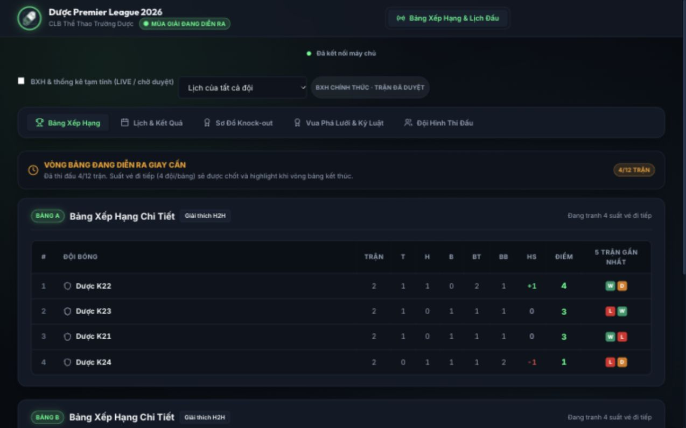

# Kết quả sửa và kiểm thử · Demo v2

Ngày kiểm tra: 02/10/2026. Nhánh: `demo`. Nền: main `02b825ffb7d8db632d592896cae560a0cfe3b12c`. Node.js 24.18.0. Dataset mẫu local riêng; không dùng tài khoản/chữ ký thật, không ghi dữ liệu Firebase/Render main.

## Kết quả chạy

- `npm run check`: lint đạt; **73/73 bài test đạt**, 0 lỗi/skip; production build đạt, chia tải ba cổng theo nhu cầu.
- `npm audit --json`: **0 lỗ hổng được npm advisory báo cáo** tại thời điểm kiểm tra. Điều này không thay thế đánh giá bảo mật ứng dụng.
- `git diff --check`: đạt. Mẫu CI lint/test/build/audit nằm ở `docs/ci-demo-workflow.yml`; chưa kích hoạt GitHub Actions vì token hiện tại thiếu quyền `workflow`.
- Test HTTP chạy server Express thực trên cổng local ngẫu nhiên; kiểm 20 request ghi sự kiện đồng thời, retry, token, validation, backup và thu hồi phiên.

## Đối chiếu phát hiện ban đầu

| Mức | Mã QA | Xử lý trong bản demo | Bằng chứng |
|---|---|---|---|
| Blocker | B01 | Bcrypt/JWT server; kiểm tài khoản còn hiệu lực; quyền theo thư ký được phân công; loại bỏ đường ghi Firebase của browser | API test login/401/403, giả role, account revoke |
| Blocker | B02 | DTO công khai có allowlist kể cả event/config/player lồng nhau; API/socket không gửi account, chữ ký, ghi chú | Test public DTO, API backup staff bị chặn |
| Blocker | B03 | Firebase Admin là nguồn production; transaction; namespace demo bắt buộc; cấm file ở production | Kiểm cấu hình/mã; migration và atomicity test local. Firebase cloud chưa chạy |
| Critical | C01 | Bảng phụ nhiều đội, tổng hai lượt, xét nhóm con; fallback GD/GF/tên ổn định | Test 36 hoán vị, hai lượt, điểm/hiệu số |
| Critical | C02 | Đỏ trực tiếp/vàng thứ hai/tích lũy tách riêng; tẩy tích lũy KO giữ án còn lại; phase luân lưu riêng | Domain/engine tests thẻ, gỡ vi phạm, điều kiện ra sân |
| Critical | C03 | Nháp theo tài khoản; IndexedDB command queue; F5 giữ event, đồng hồ, chữ ký; reconnect chống lặp | UI mất backend → ghi offline → F5 → reconnect; test clock/draft |
| Critical | C04 | Append atomic theo event ID; receipt chống retry; patch có version và chuỗi offline | 20 request HTTP đồng thời + conflict/predecessor tests |
| Critical | C05 | State machine server, score/event/điểm danh/chữ ký/version trước duyệt | Engine/API tests, UI ký–nộp–duyệt |
| Critical | C06 | Luân lưu từng lượt, luân phiên, kết thúc sớm/đột tử, winner tự tính; không tính scorer | Test 3/5 lượt, đội khách sút trước, người sút lặp, winner sai |
| Critical | C07 | Sinh đủ suất 1/2/4 bảng; chặn chưa duyệt/thiếu đội/đội trùng/nguồn bracket vòng | Tests 4 bảng, vòng tròn 2/3/4/5/8 đội, nguồn KO |
| Critical | C08 | Mở lại có reason/revision; khóa nhánh phụ thuộc; chặn nếu đã bắt đầu; xóa chữ ký cũ và ký lại/ngoại lệ | Engine tests + UI reopen/chặn duyệt thiếu chữ ký/ngoại lệ |
| Major | M01–M03 | Await write, phân biệt đã lưu local/đã xác nhận; ID cầu thủ ổn định và snapshot hồ sơ; đủ ba chữ ký | HTTP, tests profileHistory/signatureHash, UI F5 hai chữ ký |
| Major | M04 | Án có tổng/còn lại, lần chấp hành; không giảm vì xử thua, duyệt trận trước nguồn án, hoặc cầu thủ vẫn ra sân | Tests án/kỷ luật, audit quyết định |
| Major | M05 | BXH chính thức và tạm tính có nhãn; kết quả chờ duyệt/sửa vẫn nhìn thấy | Domain tests và UI khán giả |
| Major | M06 | Backup schema 2, kiểm quan hệ và lịch, backup trước replace/reset/restore; giữ account; import xem trước/gộp/undo | Engine/API tests, UI import→undo |
| Major | M07 | Event có period/addedMinute, sắp theo hiệp/bù giờ; hiệp phụ có cấu hình | Domain/engine tests, UI 20+3/20+4 |
| Major | M08 | Circle method, BYE, roundNumber; sân và nghỉ tối thiểu; giờ nhập VN/lưu UTC | RR/schedule/date tests, UI lịch |
| Major | M09 | Allowlist goal; bỏ own/shootout/cancelled; xử thua không tạo bàn cá nhân giả | Domain/engine tests |
| Minor | N01 | Lazy loading, cleanup subscription, focus trap/Escape, tab cuộn ngang, vùng scroll bảng, nút lớn mobile | Lint/build, UI desktop/mobile/modal |

## Các luồng UI đã thao tác trực tiếp

1. Thư ký đăng nhập local; tiếp tục trận LIVE, đồng hồ không reset. Ghi bàn K22 phút `20+3`, server xác nhận 1–0.
2. Tắt backend local. Ghi bàn K24 `20+4`; báo đã lưu trên máy. F5 vẫn 1–1 và đủ hai event; đồng hồ chạy theo mốc.
3. Khởi động backend: tự gửi đúng một event đang chờ; hàng đợi hết pending; file DB có đúng hai bàn, tỷ số 1–1.
4. Kết thúc trận; nộp thiếu chữ ký bị chặn. Ký hai bên, F5 còn hai chữ ký; ký trọng tài, nộp thành Chờ duyệt; BTC duyệt thành Đã xong.
5. BTC mở lại có lý do: nhìn thấy revision, chữ ký mới trống; duyệt thiếu chữ ký bị chặn; ngoại lệ có lý do được ghi và duyệt lại.
6. Upload PNG logo mẫu repo; xoay 90°; lưu JPEG 180×180, data URL dài 7.959 ký tự (xấp xỉ 5,8 KiB dữ liệu ảnh).
7. Import JSON mẫu một cầu thủ: bảng xem trước; merge; undo thành công. Không làm thay đổi hồ sơ đã có biên bản.
8. Trang khán giả không có công cụ/login quản trị, kể cả khi session BTC tồn tại. H2H modal mở/đóng bằng Escape, trả focus về nút gọi.
9. Viewport mobile yêu cầu 390×844 (IAB content width 384): document scrollWidth = clientWidth, bảng/tab cuộn riêng. Desktop kiểm ở 1280×800. Viewport override được reset sau kiểm tra.

[Ảnh mobile](demo-mobile-qa.png). `dpl-ui-prototype.html`/`dpl-ui-preview.jpg` là đề xuất thiết kế ban đầu lưu trong báo cáo, **không phải giao diện áp dụng vào app**; bản sửa giữ Stadium nền tối, xanh/vàng hiện tại.

## Tính năng bổ sung

- Trung tâm đồng bộ, xuất nháp conflict, không tự ghi đè khi có thay đổi trên thiết bị khác.
- Luân lưu từng cú, huỷ lượt cuối/đá lại, hiệp phụ tùy chọn; thẻ phase luân lưu riêng.
- Checklist duyệt, revision có biên bản cũ để xem/in, preview trận phụ thuộc và nhật ký người thao tác.
- Án theo số trận; lý do ân xá/kháng nghị, lịch sử quyết định; cảnh báo căn cứ án thay đổi.
- Lịch sân/giờ, nghỉ tối thiểu, BYE; thay lịch có lý do.
- Import xem trước/gộp/thay/hoàn tác; ID ổn định khi chỉnh tên/số áo; cắt/xoay/zoom/nén ảnh.
- Đội yêu thích, link trận, giải thích H2H, thống kê theo giai đoạn, hồ sơ mùa được lưu khi reset.
- Biên bản in có mã, version, trạng thái, sân thực tế, phân loại đỏ và lý do ngoại lệ chữ ký; CSS A4, lặp header bảng, giữ khối chữ ký.

## Giới hạn xác nhận và triển khai

- **Chưa deploy cloud**: backend người dùng cung cấp đang chạy API cũ (health không có schema 2). Mã demo chặn gửi vào API cũ. Cần triển khai service demo v2, cấu hình Render/Firebase/Netlify và account theo [DEPLOY_GUIDE](../DEPLOY_GUIDE.md). Push GitHub không cập nhật service main.
- Firebase transaction/restart/quyền RTDB và hai Render instance thực chưa được thử trên cloud; không có service account. Các rules/secrets và data migration của project thật phải kiểm tra trên namespace demo trước mở tác nghiệp.
- Kiểm offline trực tiếp là **API/backend outage và F5 trong Vite**. Service worker production đã được bổ sung cache shell/assets; chưa xác nhận chế độ airplane/sleep trên Safari iOS/Android thiết bị thật.
- Đồng hồ canonical dùng mốc server; client lưu offset giờ server để hiển thị trên các máy lệch giờ và vẫn tiếp tục nháp offline. Độ trễ mạng/thay đổi giờ máy khi hoàn toàn offline có thể ảnh hưởng hiển thị; dùng chỉnh phút và đối chiếu trọng tài. Chưa kiểm trên thiết bị sleep/airplane thực.
- Luân lưu lấy cầu thủ đã điểm danh và loại người bị truất quyền. Trọng tài cần đối chiếu eligibility thực tế ở thời điểm kết thúc (ví dụ thay người, giảm số lượng cho bằng nhau); hệ thống hiện chưa có quản lý thay người/eligible pool riêng.
- Reset tích lũy/án/thể thức được triển khai theo điều lệ mẫu trong QA ban đầu; BTC cần chốt quy định giải trước khởi tranh. Chữ ký là xác nhận thao tác trong biên bản, không phải chữ ký số PKI.
- CSS A4 đã sửa; chưa xác nhận print preview/PDF nhiều trang với 30 cầu thủ và 60 event trên mọi trình duyệt/máy in. Tải mùa cũ cần mạng; chưa có thông báo push đội yêu thích (không tự đăng ký quyền thông báo).
- Gateway xử lý toàn snapshot trong transaction, phù hợp quy mô giải hiện tại; chưa benchmark quy mô hàng nghìn trận/dữ liệu ảnh lớn. Import/restore API giới hạn 15 MB; ảnh input 12 MB/25 MP, output avatar bị giới hạn.

Không có tuyên bố “không còn mọi lỗi” hoặc “production đã được sửa”. Kết quả đạt áp dụng cho bản mã demo và phạm vi kiểm thử ghi trên.
