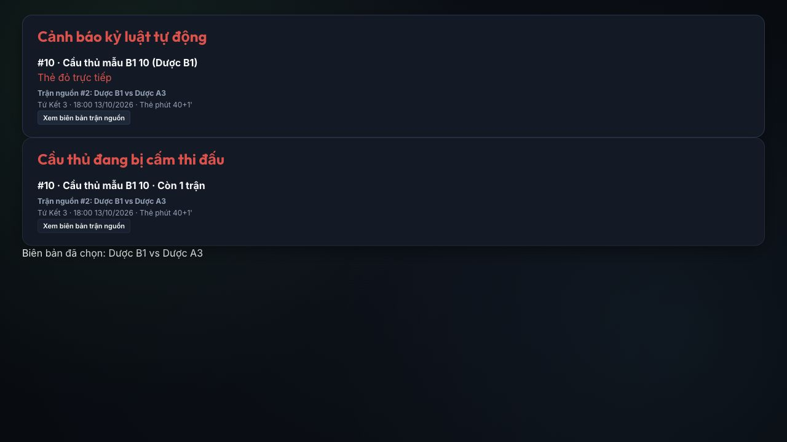

# Báo cáo kiểm thử logic — 06/10/2026

Nhánh: **demo**. Kết quả: **99/99 bài kiểm tra đạt**, không fail/skip; lint và production build đạt; `git diff --check` đạt.

## Những thay đổi được kiểm tra trong lần này

- Cảnh báo kỷ luật và án đang chấp hành hiển thị STT, cặp đấu, vòng, ngày giờ và phút thẻ khi dữ liệu có sẵn. Mã trận dùng để tra nguồn; STT chỉ là thứ tự lịch hiện hành.
- BTC mở đúng biên bản nguồn từ cảnh báo. Án mới lưu tên/vòng/giờ/phút nguồn làm thông tin đối chiếu nếu trận không còn trong lịch.
- Sửa cách lấy vị trí tứ kết/bán kết: sắp theo số trong tên vòng, không dùng thứ tự đối tượng Firebase hoặc ngày giờ. Cả phần tạo vòng sau và cây knockout dùng cùng quy tắc.
- Hướng dẫn sử dụng và README được cập nhật theo hành vi hiện tại, bỏ mô tả cũ về nút BXH tạm tính cho khán giả.

## Phạm vi và bằng chứng

| Nhóm chức năng | Kiểm tra đã chạy |
|---|---|
| Tài khoản/quyền | Login đúng/sai, không token, khác thư ký phụ trách, giả role, tạo tài khoản chỉ admin, mật khẩu bcrypt, trùng username/đồng thời, thu hồi phiên |
| Dữ liệu công khai | Không lộ account, password, chữ ký, ghi chú và trường riêng lồng nhau; API backup riêng cho BTC; kết quả chính thức dựa vào trạng thái duyệt |
| BXH | Điểm 3/1/0, tổng GF/GA, H2H hai lượt, tam giác H2H qua các hoán vị, không tính LIVE/chờ duyệt vào BXH chính thức |
| Cầu thủ/cấu hình | ID ổn định, số áo trùng, đội hình giả ID, giữ hồ sơ đã có biên bản, cấm thay điều lệ sau tác nghiệp, logo raster/đơn vị tổ chức |
| Vòng tròn/lịch | 2/3/4/5/8 đội đủ cặp, không trùng đội trong vòng; chặn trùng sân và nghỉ quá ngắn; UTC/giờ Việt Nam; STT chung và ổn định khi lọc |
| Ghi sự kiện | Bàn thường/penalty/phản lưới, loại luân lưu và event hủy khỏi scorer; ID trùng nội dung khác, 20 HTTP request đồng thời, replay chống trùng, phiên bản/xung đột |
| Đồng hồ/nháp | Mốc thời gian qua F5/background, chỉnh bù giờ, hiệp phụ, lệch giờ client; nháp chữ ký theo phiên bản; hàng đợi gửi cả thao tác thêm giữa lúc đang gửi, offline retry |
| Nộp/duyệt/mở lại | Tỷ số–sự kiện, đủ chữ ký, thiếu chữ ký/ngoại lệ, duyệt nguyên trạng không cần ghi chú, đảo key như Firebase, sửa nội dung cần lý do; khóa nhánh sau khi mở lại, chặn khi trận phụ thuộc bắt đầu |
| Kỷ luật | Đỏ trực tiếp/vàng thứ hai/tích lũy, tẩy vàng KO giữ án, tách thẻ luân lưu, ân xá không che vi phạm khác, án giảm đúng một lần, không giảm sai khi vẫn tham gia hoặc xử thua; xác định đúng trận nguồn |
| Luân lưu | 3/5 lượt, kết thúc sớm/đột tử, đội khách sút trước, luân phiên, chu kỳ người sút, không đủ điều kiện vì đỏ/vàng thứ hai; lượt bị hủy; điểm 4–1 không dùng tổng cũ 2–1; thao tác sai không gọi lưu, lỗi 422 không còn trong hàng đợi |
| Knockout | 6 tổ hợp 1/2/4 bảng × tứ kết/bán kết, đủ suất, đúng seed, không tạo khi vòng bảng thiếu duyệt; vị trí nhánh không lệ thuộc thứ tự dữ liệu/lịch |
| Sao lưu/reset | Backup schema 2, lỗi import không đổi dữ liệu, tài khoản không xuất và được giữ khi phục hồi/reset, hồ sơ mùa có allowlist, backup trước reset, JSON test vòng bảng đã kiểm tra phục hồi local |

## Kiểm thử xuyên suốt mùa giải bổ sung

`tests/lifecycle.test.js` đi qua máy xử lý lệnh thật trong bộ nhớ:

1. 4 bảng × 4 đội, mỗi đội 10 cầu thủ; sinh đủ 24 trận.
2. Tác nghiệp bằng vai trò thư ký, ghi bàn, lấy đủ chữ ký, nộp và BTC duyệt từng trận.
3. Sinh 4 tứ kết; cố ý đảo thứ tự chèn dữ liệu và giờ đá so với nhãn vòng.
4. Tạo bán kết đúng nguồn thắng tứ kết 1–2 và 3–4, duyệt đủ hai bán kết.
5. Tạo chung kết/tranh hạng 3 theo nguồn thắng/thua, duyệt đủ; chung kết hòa 1–1, luân lưu 4–1.
6. Kiểm tra luân lưu không cộng vào Vua phá lưới, toàn giải có 32 trận; khép lại mùa, kiểm tra backup và reset giữ tài khoản/hồ sơ mùa.
7. Kiểm tra mở lại bán kết bị chặn khi vòng sau đã tác nghiệp.

## Kiểm tra giao diện

Preview local của thành phần dùng chính mã ứng dụng: cảnh báo/án đều hiện đúng cặp nguồn, giờ Việt Nam và phút `40+1'`; nút xem biên bản chọn đúng trận. Điện thoại rộng 390 px không tràn ngang.



Các lần kiểm tra liên quan trước đó đã xác minh luân lưu chia hai đội trên điện thoại/iPad; thẻ đỏ/vàng thứ hai khóa option; sai lượt đội khóa ghi và không gọi lưu; thao tác hợp lệ gọi lưu một lần.

## Cách chạy lại

```sh
npm run lint
npm test
npm run build
```

Test HTTP cần quyền mở cổng localhost. Test dùng dữ liệu trong bộ nhớ/API local, không dùng tài khoản/chữ ký thật.

## Giới hạn thực tế

- Lần này không nộp/duyệt hoặc reset thay người dùng trên Firebase demo; không thay dữ liệu main. Không dùng bộ test để ghi 32 trận mẫu lên cloud.
- Kiểm thử xuyên suốt là kiểm thử máy xử lý nghiệp vụ, không phải tự bấm toàn bộ 32 trận qua trình duyệt.
- Không mô phỏng mọi tình huống mạng di động thực tế, camera/upload trên mọi thiết bị, máy in vật lý hoặc tải sản xuất. Các kiểm tra logic và preview không chứng minh mọi môi trường đều không còn lỗi.
- Thông tin nguồn cũ thiếu ID/ngày/phút không thể suy ra chắc chắn; giao diện hiển thị phần có sẵn và không gán sang trận khác.
